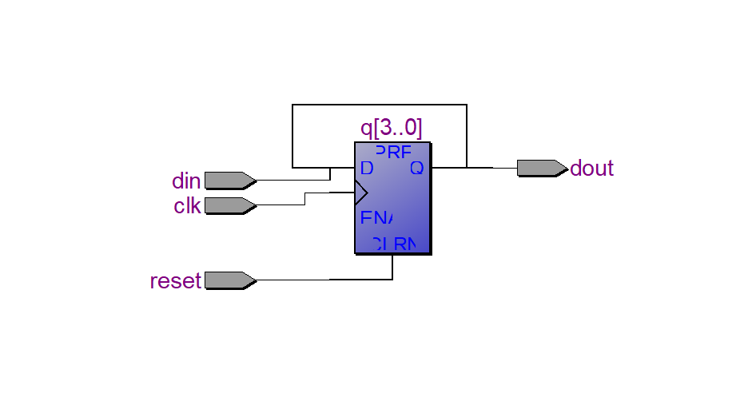
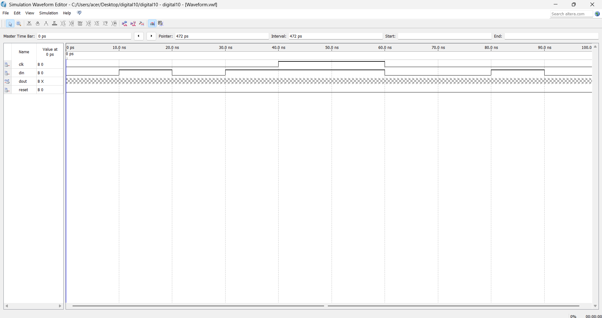

# SERIAL-IN-SERIAL-OUT-SHIFTREGISTER

**AIM:**

To implement  SISO Shift Register using verilog and validating their functionality using their functional tables

**SOFTWARE REQUIRED:**

Quartus prime

**THEORY**

**SISO shift Register**

A Serial-In Serial-Out shift register is a sequential logic circuit that allows data to be shifted in and out one bit at a time in a serial manner. It consists of a cascade of flip-flops connected in series, forming a chain. The input data is applied to the first flip-flop in the chain, and as the clock pulses, the data propagates through the flip-flops, ultimately appearing at the output.

The logic circuit provided below demonstrates a serial-in serial-out (SISO) shift register. It comprises four D flip-flops that are interconnected in a sequential manner. These flip-flops operate synchronously with one another, as they all receive the same clock signal.


Figure 01 4 Bit SISO Register

The synchronous nature of the flip-flops ensures that the shifting of data occurs in a coordinated manner. When the clock signal rises, the input data is sampled and stored in the first flip-flop. On subsequent clock pulses, the stored data propagates through the flip-flops, moving from one flip-flop to the next.
Each D flip-flop in the circuit has a Data (D) input, a Clock (CLK) input, and an output (Q). The D input represents the data to be loaded into the flip-flop, while the CLK input is connected to the common clock signal. The output (Q) of each flip-flop is connected to the D input of the next flip-flop, forming a cascade.

**Procedure**
1.Start the program and declare the module with inputs (clk, reset, din) and output (dout). 2.Declare a 4-bit register q to store the shift register values. 
3.On every positive edge of the clock: If reset = 1, clear the register by assigning 0000. Otherwise, shift the bits left and insert din into the least significant bit. 
4.Assign the most significant bit q[3] as the serial output dout. 
5.End the module and verify the shifting operation using simulation in Quartus II.

**PROGRAM**
```
module digital10( 
    input clk,
    input reset,
    input din,
    output dout
);

reg [3:0] q;

always @(posedge clk or posedge reset)
begin
    if (reset)
        q <= 4'b0000;
    else
        q <= {q[2:0], din};
end

assign dout = q[3];

endmodule
```
Developed by: RegisterNumber: 212225040207

*/

**RTL LOGIC FOR SISO Shift Register**


**TIMING DIGRAMS FOR SISO Shift Register**


**RESULTS**
The SISO Shift Register was successfully implemented using Verilog, and its functionality was verified using the functional table and simulation waveform.
